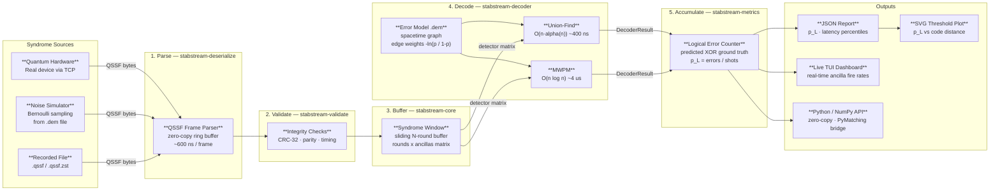
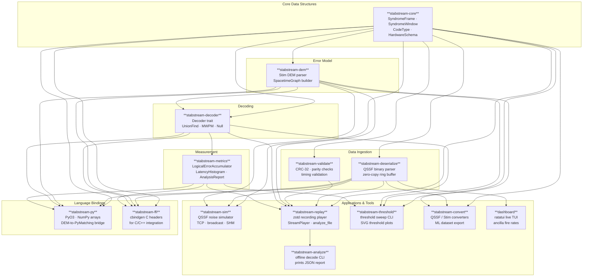
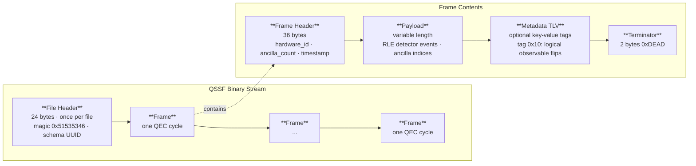
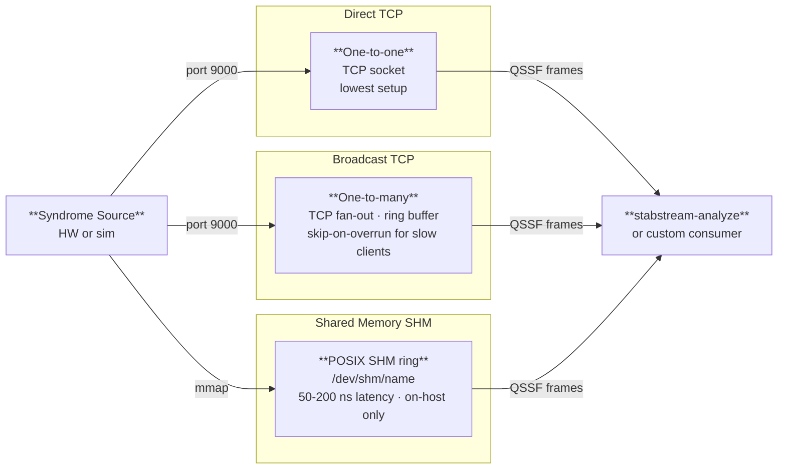
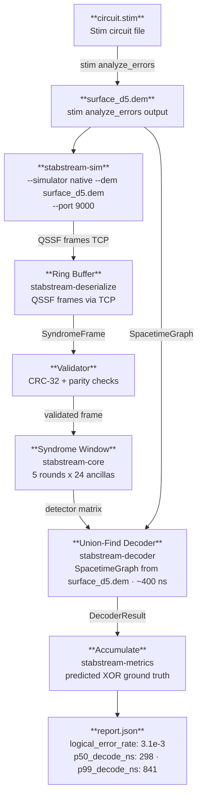

# stabstream Architecture

> A visual guide for quantum researchers new to the codebase.

stabstream is a real-time **quantum error correction (QEC) pipeline**. It takes raw
ancilla measurement results from a quantum device (or simulator), runs a decoder to
infer the most likely error pattern, and tracks how often the decoder fails — giving
you the **logical error rate** p_L.

---

## The Big Picture

Every QEC experiment follows the same loop:

1. Run stabilizer measurements → get **syndromes** (which ancillas fired)
2. Feed syndromes into a **decoder** → get a predicted correction
3. Compare the correction to ground truth → did we recover the logical state?
4. Repeat and accumulate → compute the **logical error rate p_L**

stabstream automates this loop at hardware speed.

---

## Pipeline Overview

### Stage-by-stage explanation

| Stage | What happens | Key QEC concept |
|-------|-------------|-----------------|
| **Syndrome Sources** | Ancilla measurement results arrive as a binary stream in QSSF format — one frame per QEC cycle | Stabilizer measurements yield a syndrome: a bit string indicating which stabilizers anticommuted with the error |
| **Parse** | The QSSF binary stream is decoded frame-by-frame using a zero-copy ring buffer. Detector events are RLE-compressed (only the ancillas that *changed* are stored) | A *detector event* fires when an ancilla gives a different result than its previous measurement — the spacetime signal used by decoders |
| **Validate** | Each frame is checked for CRC integrity, parity consistency, and timing plausibility. Bad frames are flagged before reaching the decoder | Corrupt syndrome data would cause spurious corrections; validation protects error-rate statistics |
| **Buffer** | Frames are accumulated into a *syndrome window*: a matrix of `rounds × ancillas` booleans. Most decoders need multiple rounds to resolve ambiguous errors in time | Space-time decoding uses correlations across rounds to improve accuracy |
| **Decode** | The decoder is given the syndrome window and a *Detector Error Model* (DEM). It constructs a spacetime graph and finds the minimum-weight set of errors consistent with the observed syndrome | The DEM encodes which physical errors produce which detector events and with what probability |
| **Accumulate** | The decoder's predicted observable flips are XOR'd against the ground-truth logical outcome. Mismatches are logical errors. Counts are stored in lock-free atomic integers | p_L = (logical errors) / (total shots) |
| **Outputs** | Reports, plots, a TUI dashboard, or Python-accessible arrays | A threshold plot shows how p_L scales with code distance — when it decreases, you are below threshold |

---

## Component Map

Each crate has a single responsibility. The arrows show compile-time dependencies.

---

## QSSF Frame Anatomy

Every QEC cycle produces one **QSSF frame** on the wire. Here is what is inside it:

**Why RLE?** In a well-functioning device most ancillas agree with the previous round
(no error). Run-length encoding stores only the ancillas that *changed*, shrinking a
frame from O(ancilla count) to O(error weight), which is typically very small.

**Tag 0x10 (ground truth):** When generating data with `--with-observables`, Stim
embeds the true logical outcome in this tag. stabstream uses it to score the decoder:
`logical_error = predicted_flips XOR ground_truth_flips`.

---

## Transport Modes

stabstream supports three ways to deliver QSSF frames to a consumer:

Use **direct** for single-consumer experiments, **broadcast** to feed multiple tools
at once (e.g., dashboard + analyzer simultaneously), and **SHM** when the simulator
and decoder run on the same host and latency matters.

---

## End-to-End Example Walk-Through

---

## Decoder Comparison

| Decoder | Algorithm | Latency (d=5) | Quality | Use case |
|---------|-----------|--------------|---------|----------|
| `union-find` | Union-Find (Delfosse & Nickerson 2021) | ~400 ns | Near-optimal | Real-time, default choice |
| `mwpm` | Minimum-Weight Perfect Matching (Fusion Blossom) | ~4 µs | Optimal | Offline analysis, threshold benchmarks |
| `null` | No-op | < 5 ns | None | Parser/validator benchmarking |

The **threshold** is the physical error rate p* below which p_L *decreases* as
code distance d increases. Use `stabstream-threshold run` to locate it for your
hardware's noise model.

---

## Further Reading

| Resource | Location |
|----------|----------|
| QSSF binary format specification | [`spec/QSSF_FORMAT.md`](spec/QSSF_FORMAT.md) |
| QEC primer (stabilizers, syndromes, thresholds) | [`docs/theory/qec_primer.md`](docs/theory/qec_primer.md) |
| Decoder algorithm guide | [`docs/theory/decoder_guide.md`](docs/theory/decoder_guide.md) |
| Five-command quick-start | [`QUICKSTART.md`](QUICKSTART.md) |
| Tutorial notebooks | [`notebooks/`](notebooks/) |
| Hardware integration guide | [`docs/tutorials/hardware_integration.md`](docs/tutorials/hardware_integration.md) |
